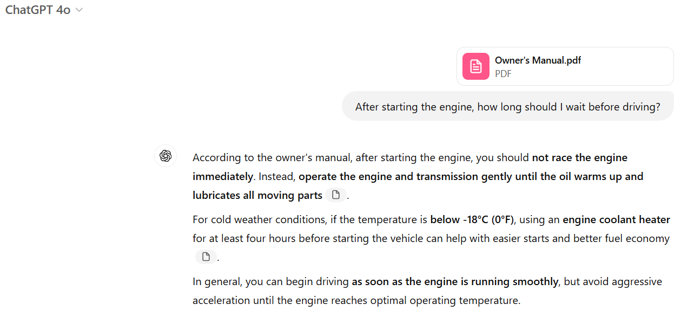
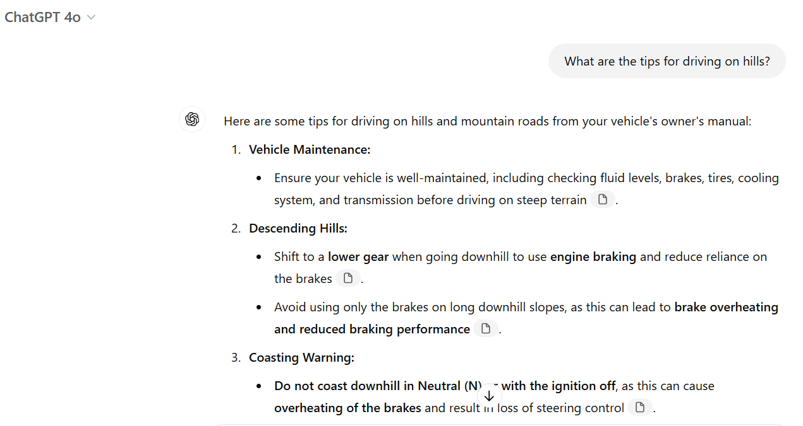
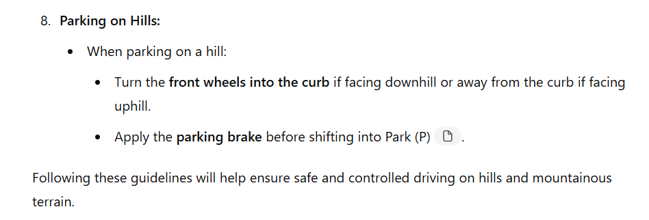
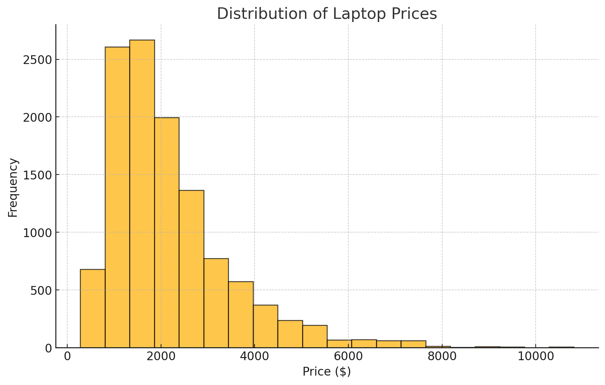
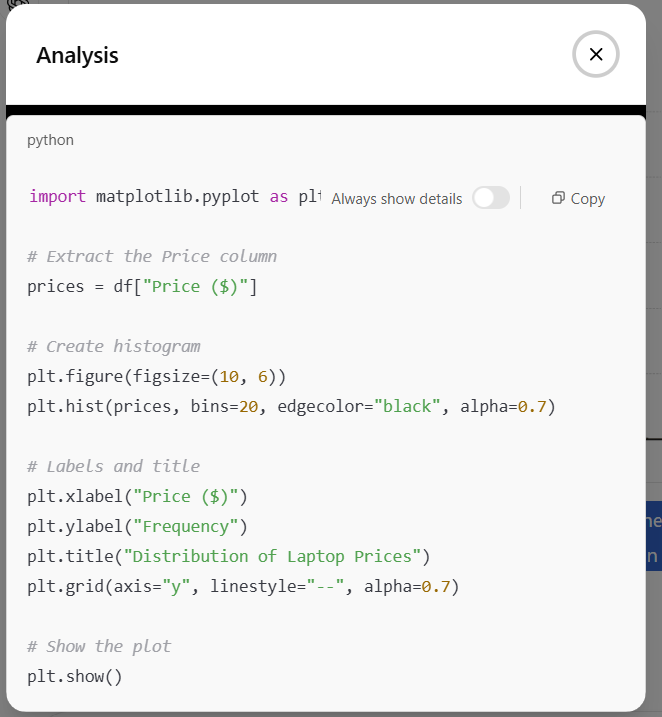
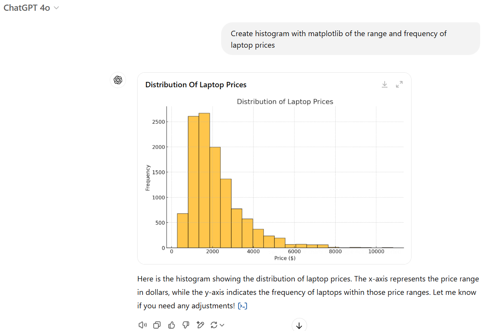

# Chat with data over pdf document

## Link to pdf document

[Chevrolet Malibu User Manual](https://www.chevrolet.com/ownercenter/content/dam/gmownercenter/gmna/dynamic/manuals/2017/Chevrolet/Malibu/Owner's%20Manual.pdf)

## User Prompt #1

After starting the engine, how long should I wait before driving?

## AI response #1

According to the owner's manual, after starting the engine, you should **not race the engine immediately**. Instead, **operate the engine and transmission gently until the oil warms up and lubricates all moving parts**​
.

For cold weather conditions, if the temperature is **below -18°C (0°F)**, using an **engine coolant heater** for at least four hours before starting the vehicle can help with easier starts and better fuel economy​
.

In general, you can begin driving **as soon as the engine is running smoothly**, but avoid aggressive acceleration until the engine reaches optimal operating temperature.

## User Prompt #2

What are the tips for driving on hills?

## AI response #2

Here are some tips for driving on hills and mountain roads from your vehicle's owner's manual:

1. **Vehicle Maintenance:**

 - Ensure your vehicle is well-maintained, including checking fluid levels, brakes, tires, cooling system, and transmission before driving on steep terrain​
.
2. **Descending Hills:**

 - Shift to a **lower gear** when going downhill to use **engine braking** and reduce reliance on the brakes​
.
 - Avoid using only the brakes on long downhill slopes, as this can lead to **brake overheating and reduced braking performance​
.**
3. **Coasting Warning:**

 - **Do not coast downhill in Neutral (N) or with the ignition off,** as this can cause **overheating of the brakes** and result in loss of steering control​
.
4. **Speed Control and Lane Discipline:**

 - Drive at speeds that keep your vehicle within its **own lane** and avoid swerving or crossing the center line​
.
 - Be alert at the crest of hills for potential obstacles such as stalled cars or accidents​
.
5. **Pay Attention to Road Signs:**

 - Look for warning signs indicating **falling rocks, winding roads, steep grades, or no-passing zones** and adjust your driving accordingly​
.
6. **Using Cruise Control:**

 - Cruise control may not function effectively on steep hills, and you may need to **manually accelerate or brake** to maintain speed​
.
7. **Hill Start Assist (HSA):**

 - If your vehicle is equipped with **Hill Start Assist,** it will hold the vehicle stationary for **up to two seconds** after you release the brake pedal to help prevent rollback​
.
8. **Parking on Hills:**

 - When parking on a hill:
   - Turn the **front wheels into the curb** if facing downhill or away from the curb if facing uphill.
   - Apply the **parking brake** before shifting into Park (P)​
.
Following these guidelines will help ensure safe and controlled driving on hills and mountainous terrain.

# Histogram with Matplotlib

## Link to datasource

[Laptop Price Dataset](https://www.kaggle.com/datasets/asinow/laptop-price-dataset/data)

## User Prompt #1

Create histogram with matplotlib of the range and frequency of laptop prices

## AI response #1

Here is the histogram showing the distribution of laptop prices. The x-axis represents the price range in dollars, while the y-axis indicates the frequency of laptops within those price ranges. Let me know if you need any adjustments!

