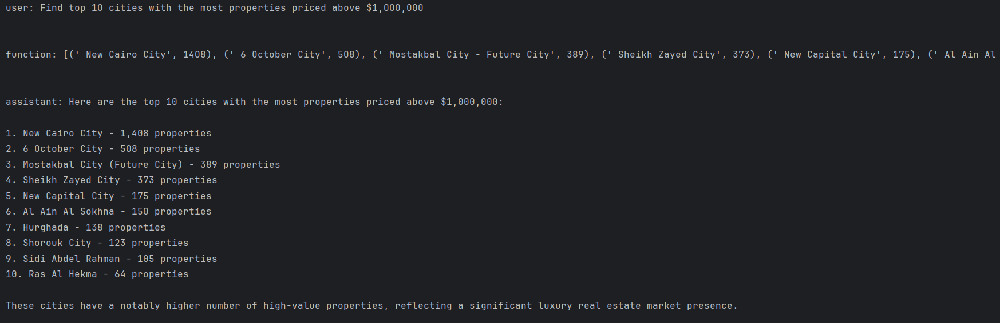

# Chatbot to answer user questions related to real estate properties

## Main points
 - **Imports Required Modules:** Loads libraries for API requests, database access, and environment variable management.
 - **Loads API Key:** Retrieves the OpenAI API key from a .env file.
 - **Defines Constants:** Sets model name (GPT-4o), database path, and a user query about real estate prices.
 - **Implements API Request with Retry Logic:** Uses OpenAI’s Chat API with automatic retries for robustness.
 - **Connects to SQLite Database:** Establishes a connection to property_data.sqlite.
 - **Defines Database Schema:** Outlines the structure of the facts_buy table containing real estate data.
 - **Creates a Function for SQL Query Execution:** Runs queries against the database and handles errors.
 - **Implements Chat Functionality:** Processes user queries, calls OpenAI to generate SQL, executes it, and returns results.
 - **Handles Errors and Query Corrections:** If a generated SQL query fails, it asks OpenAI to fix it and retries execution.
 - **Maintains Conversation History:** Logs user queries and responses for improved interactions.
 - **Displays Final Response:** Outputs results in a structured format.

## Screenshot of the result

## Link to dataset
[Property Finder Egypt data 2023/Nov.](https://www.kaggle.com/datasets/ahmed121ashraf131/property-finder-egypt-data)