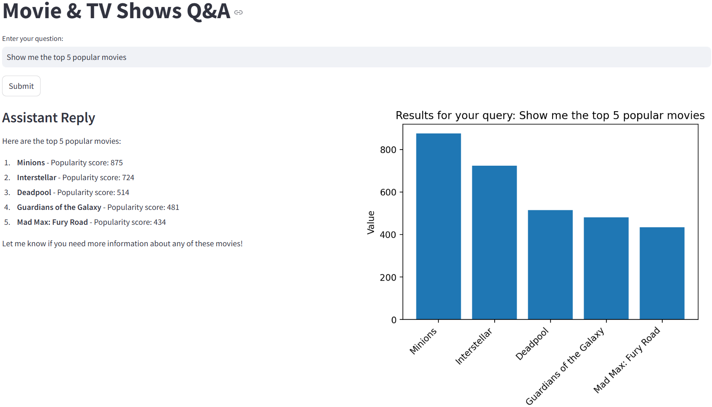
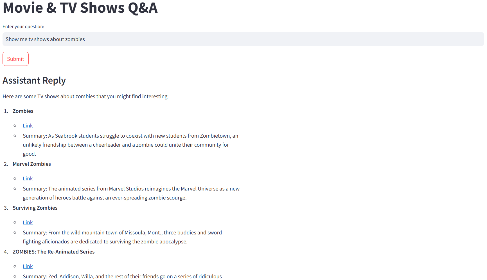
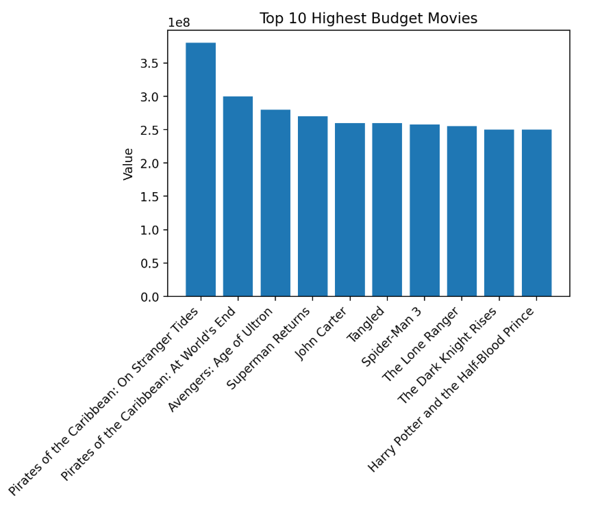
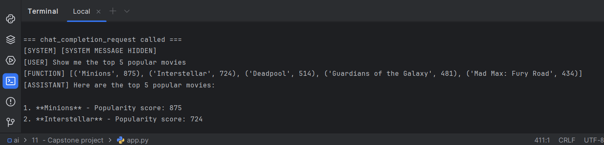

# Capstone Project: Movie & TV Shows Q&A

This project is a Streamlit-based application that uses OpenAI’s GPT model to answer questions about movies and TV shows. The agent can:
- Query an internal SQLite database to retrieve movie data, and  
- Call the TVMaze API for TV show queries.

It displays a text-based chat interface (via Streamlit) alongside dynamic charts of movie data.

---

## Installation Instructions

1. **Clone the repository** (or download) into your local environment:
   ```bash
   git clone https://github.com/ukhalilov/masters-ai/tree/main/11%20%20-%20Capstone%20project
   cd repo

2. **Install required dependencies:** Make sure you have streamlit, openai, requests, tenacity, matplotlib, pandas, and sqlite3 available.
3. Create .env and set your API key to `OPENAI_API_KEY`
4. Before running **Streamlit application**, make sure you are in the application folder `11  - Capstone project` and run the project via terminal:
   ```bash
   streamlit run app.py
   
5. **Open your browser** to the URL shown (typically http://localhost:8501) to interact with the app.

## How This Project Meets Requirements

### Functional Requirements

- **Agent should assist user in getting information from the datasource**  
  - The agent uses the `ask_database` function to query the SQLite database for movie-related questions.  
  
  - Only relevant query results (partial data) are returned to the LLM, so the full datasource is never exposed.

- **Agent should be able to call a function to run an action via API in any 3rd party system**  
  - The agent calls the `ask_tvmaze` function, which queries the TVMaze API for TV show-related queries.  
  - This external API call demonstrates the use of a 3rd party system.
  

- **User interface should reflect some business information apart from chat**  
  - The Streamlit UI displays dynamic business information in the form of a matplotlib histogram (e.g., showing the top 10 highest-budget movies by default or query-based results).
  

- **Log printing and AI Regulation and Security**  
  - Detailed logs are printed to the console, including function calls and conversation flow, while system prompt contents are redacted to **prevent leakage**.
  
  - As shown the system messages are hidden

### Non-Functional Requirements

- **Agent should be built with Python ≤ 3.12**  
  - The project is developed using Python 3.x (compatible with Python 3.12 and earlier).

- **UI should be built with Streamlit**  
  - The interactive user interface and dynamic visualizations are implemented with Streamlit.

- **At least 2 different tools should be used in function calling**  
  - Two distinct tools are used:
  1. **SQLite Database** (via the `ask_database` function)
  2. **TVMaze API** (via the `ask_tvmaze` function)
